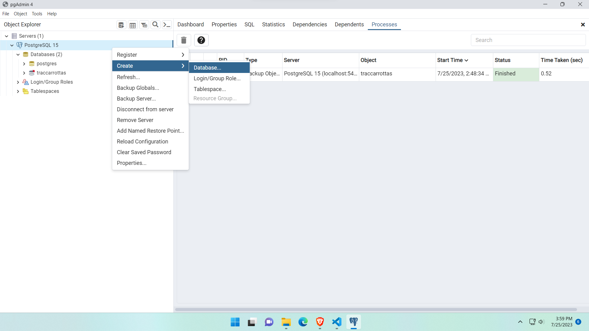
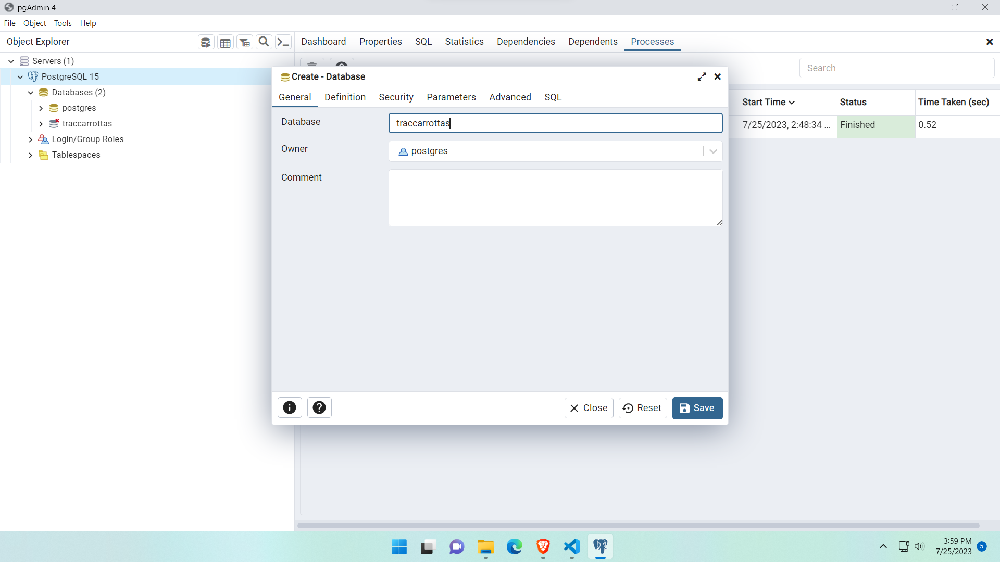
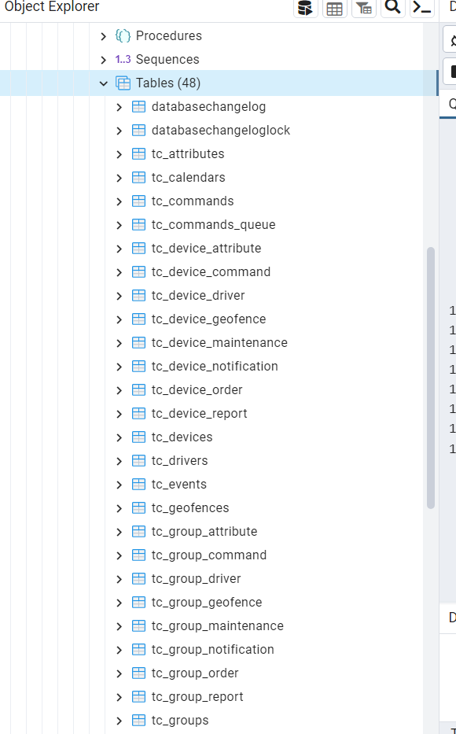
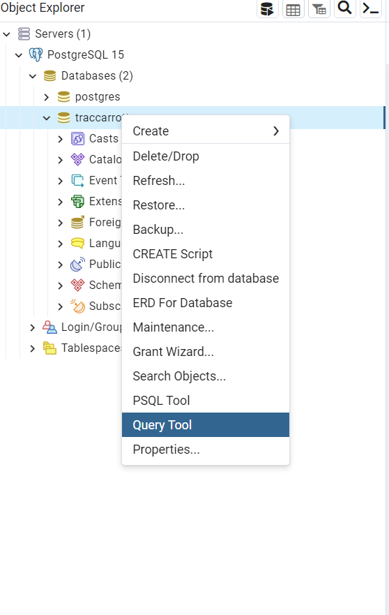
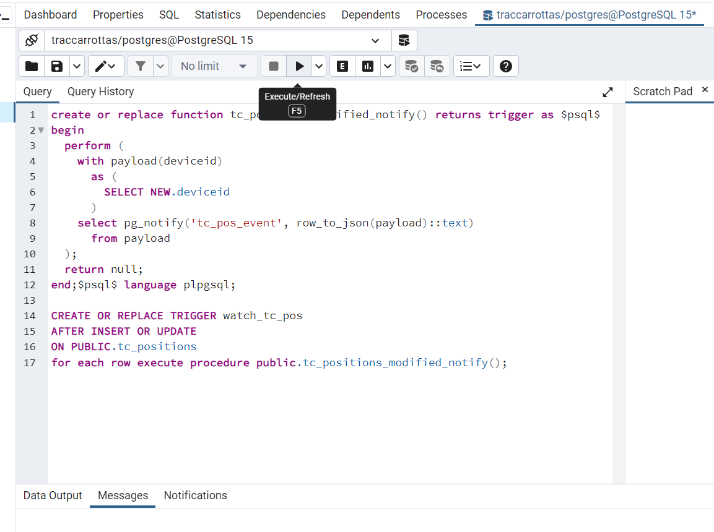

# Como instalar?
## 1 - Requisitos do servidor
- O Traccar deve ficar na porta 8082, que deve estar disponível. Caso não possa ser essa porta, a nova porta deve ser informada editando o arquivo *traccar.xml*, que fica na pasta C/Program Files/Traccar/conf
- O endereço do server node é irrelevante porque não está sendo usado, só estamos usando o app node mesmo. Então se der bode pode mudar.

## 2 - Como instalar
### 2.1 - Instalar Traccar server
    https://www.traccar.org/download/
### 2.2 - Possuir o Postgres/pgAdmin Instalado
    Usamos a versão 17.3 pgAdmin4 com PostgreSQL 15
### 2.3 - Criar o banco de dados no Postgres Server ou fazer backup do já existente
- É preferível que o banco tenha o nome de *traccarrottas*, bem como as demais configurações designadas no arquivo *.env*:
    - user = postgres
    - password = 1234abcd
    - database = traccarrottas
    - postgres port = 5432

#### 2.3.1 - Caso vá criar o db, a criação do db segue a ordem:
1) Abrir o pgAdmin, clicar com o direito e criar um database

2) Criar um db com o nome traccarrottas

- Caso alguma dessas configurações seja diferente, o arquivo .env precisa ser alterado.
### 2.4 - Conferir as credenciais no arquivo traccar.xml
- Conferir se a porta, usuário e senha estão de acordo.
- Copiar o arquivo para C:\Program Files\Traccar\conf
        - Substituir o arquivo *traccar.xml* que estava nessa pasta.
        - O *default.xml* vem por padrão e serve apenas de referência para caso algo seja feito errado, se corrompa, etc. Não é necessário mexer nele.
### 2.5 - Windows > Serviços > Traccar Server > Iniciar
- Isso vai fazer com que o Traccar "leia" o banco de dados e inicialize todas as tabelas necessárias (caso tenha criado um banco ao invés de fazer backup de um dos nossos)
- Em seguida, ir em serviços e Parar/Stop o traccar.
### 2.6 - Criação do Trigger de atualização de posição
- Essa etapa é necessária caso o banco tenha sido criado do zero. O traccar já inicializou as tabelas, então podemos criar o trigger.
- **IMPORTANTE:** ESSA ETAPA SÓ FUNCIONA CASO O TRACCAR JÁ TENHA INICIALIZADO AS TABELAS DO DB. Então é de suma importância que a etapa 2.5 tenha sido feita com sucesso. Isso pode ser inspecionado verificando a existência de diversas tabelas no banco, como exemplificado na figura abaixo (PosgreSQL 15 > traccarrottas > Schemas > Public > Tables(48)):

#### 2.6.1 Basta executar uma query com o conteúdo do arquivo *sql_trigger.sql*.

1) Abrir o SQL QUERY
   

2) Copiar e colar o texto de *sql_trigger.sql* e executar para criar o trigger que permite dar *watch* na atualização de posições.

### 2.7 - Conferir as credenciais do arquivo .env
- Conferir se o arquivo .env está com as credenciais corretas
### 2.8 - Services > Iniciar/Start o Traccar novamente
### 2.9 - Executar o arquivo rottas_traccar_backapp.js
- Agora a aplicação já deve estar funcionando plenamente. Caso se faça necessário testar, no topo do arquivo existem "configs" (booleanos) que permitem prints com as queries para acompanhar o sistema.

